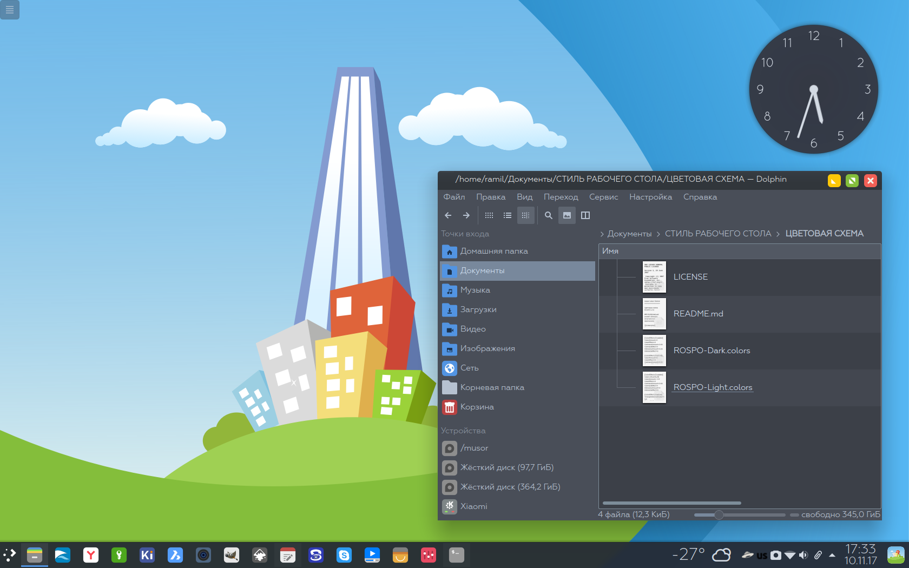

plasma5-color-scheme-rospo
===============

Цветовая схема Neru v1.0

## Особенности

* Светлая и тёмная темы

## Установка

`git clone https://github.com/chistota/plasma5-color-scheme-rospo.git /usr/share/color-schemes`

## Сообщество
РОСПО Дизайн-студия
https://vk.com/rospodesign
